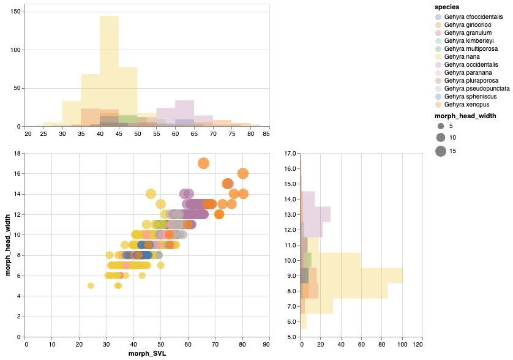
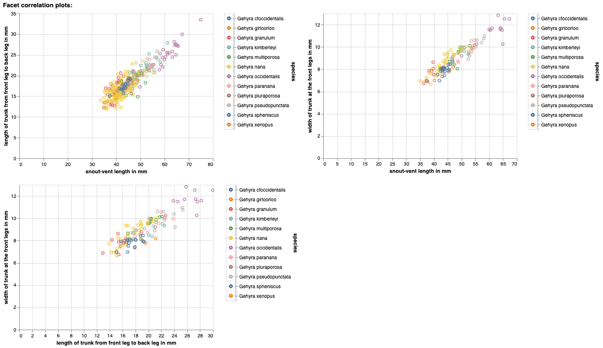
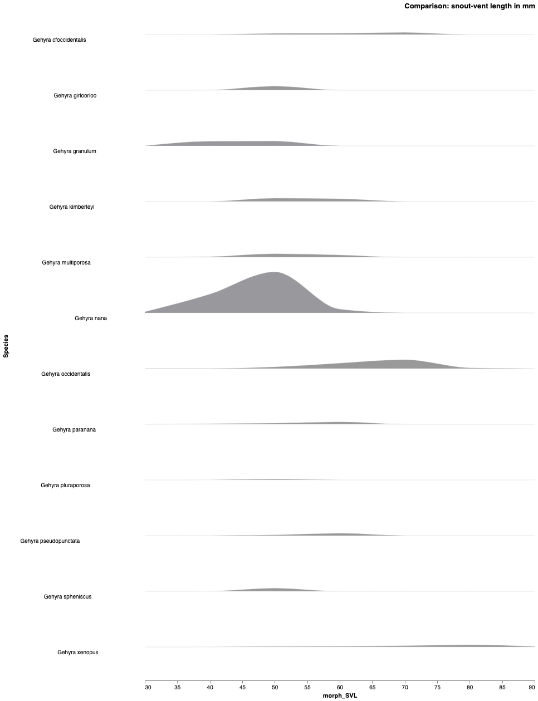
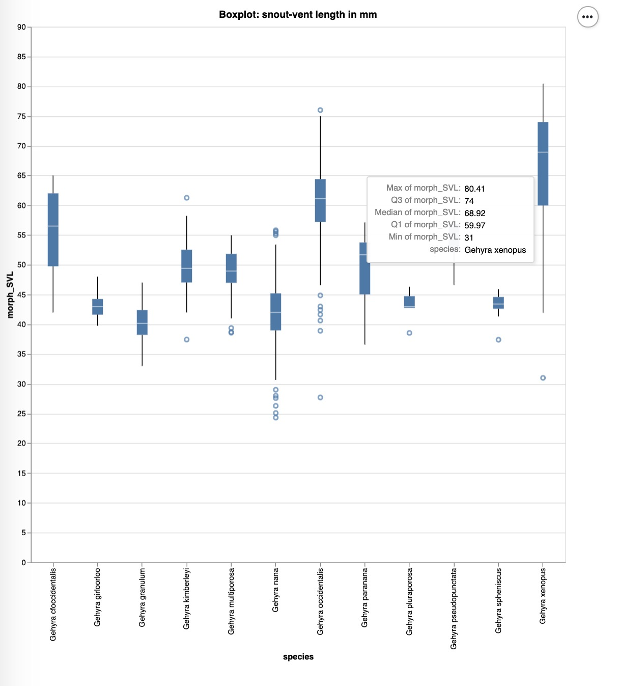

# README

### Before you Begin

Before you begin, please install the latest python and pip software. If you have any issues with that, feel free to contact the IT people. 

- [Download Python | Python.org](https://www.python.org/downloads/) and pip.
- Chrome Browser
- git clone this project
- In your terminal, please do `pip3 install -r requirement.txt  ` to install all the external libraries in a easy way.
- Make sure your terminal currently in local directory.


### Specify the variable type (Using Your Own data)

- __Checking all the columns of data already defined in metadata.csv File: __ In `data/` folder, if you are about to use the attributes not specified in the `character_female_means_trait_metadata.csv `, enter your extra attributes in that csv file.

- Put your data in `./data/` folder.


#### Test Data and User Guide

- We put one of the testing datasets in the `/data/` folder to demonstrate the use case of this software tool.
- Take `./data/character_all_data.csv` as an example.


#### Getting program help in a easy way:

- Enter `python3 main.py -h` in your program, and all the program option is printed in your terminal.

  ```
  usage: main.py [-h] [-his] [-x X] [-y Y] [-correlations]
                 [-attributes ATTRIBUTES] [-ridge] [-box]
                 data
  
  positional arguments:
    data                  input data
  
  optional arguments:
    -h, --help            show this help message and exit
    -his, --histogram     generate interactive histograms based on input data
    -x X, --x X           x variable of the input data
    -y Y, --y Y           y variable of the input data
    -correlations, --correlation_plots
                          correlation plot in pairs (interactive with selection
                          enabled)
    -attributes ATTRIBUTES, --attributes ATTRIBUTES
                          selected attributes to plot
    -ridge, --ridgeline   ridgeline plot based on selected attribute
    -box, --boxplot       interactive box plot
  ```


### Use Case 1: Histogram with Scatterplot

- x variable: morph_SVL

- y variable: morph_head_width
- __Command Line:__

```bash
python3 main.py  ./data/character_all_data.csv -his -x morph_SVL -y morph_head_width
```

> ​	python3   main	+ (data_path_in_machine)   -his     -x + (x_variable)  -y +  (y_variable)


__Sample Output: __




### Use Case 2: Interactive scatterplots in pairs

```bash
python3 main.py  ./data/character_all_data.csv -correlations -attributes morph_SVL, trunk_length, trunk_width
```

>python3 main.py   +(data_path) -correlations -attributes +attributes_list_in_data's_columns

__Selected attributes in sample:__ morph_SVL, trunk_length, trunk_width
__Notice__: attributes are seperated by space !
__Feature to play with:__

- Interactive Zoom in data points area
- Species Selection in Panel area

__Sample Output:__




### Use Case 3: Ridgeline plot

```
python3 main.py  ./data/character_all_data.csv -ridge -x morph_SVL
```

> python3 main.py +(data_path_in_machine) -ridge -x +attributes_to_compare





### Use Case 4: Boxplot

```bash
python3 main.py  ./data/character_all_data.csv -box -x morph_SVL
```

> python3 main.py +data_path -box -x +selected_attributes

__Feature to Play with:__ Display the quantile when mouse closer to the box in HTML page




### **Maintenance** and Help

[Xing (Nicole) Yu](u6034476@anu.edu.au) with ☕

Under the supervision of: Dr. Renee Catullo and E&E Group in School of Biology 

Australian National University

